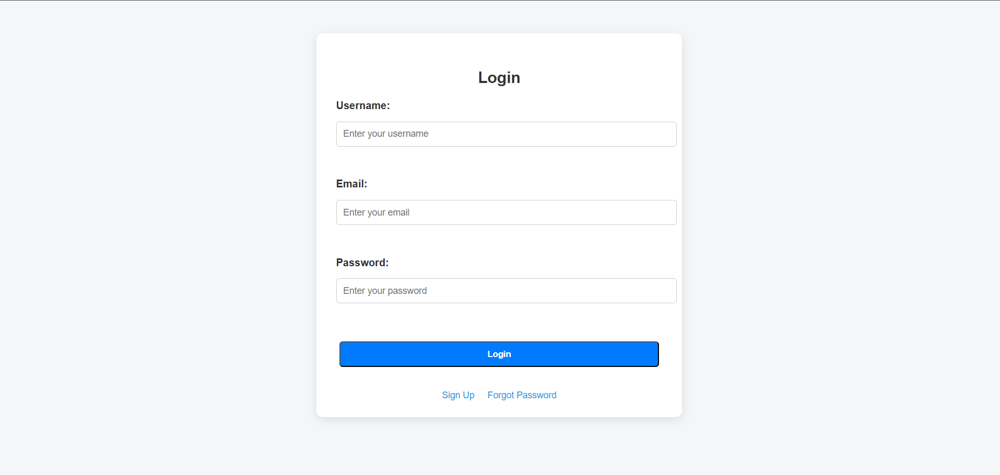
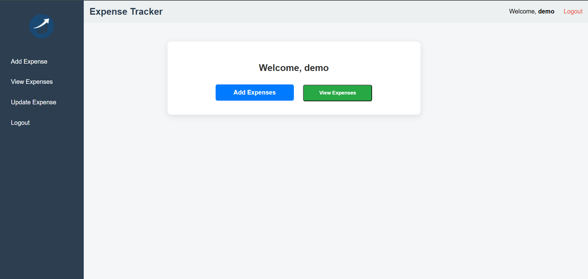
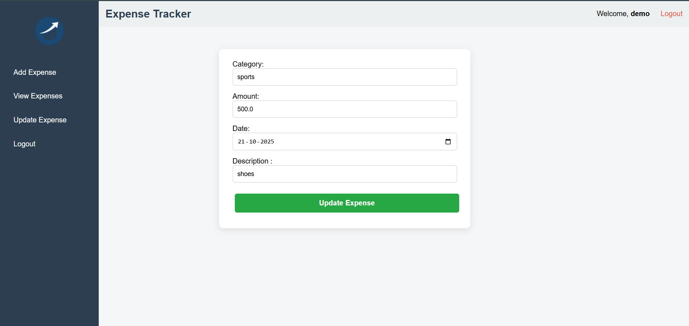
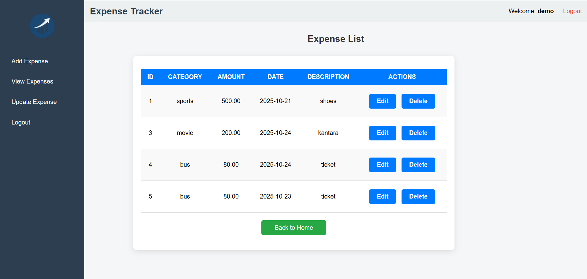

# Expense Tracker


**Expense Tracker** is a lightweight, user-friendly **expense management application** built in **Java** with a web interface. It helps users track daily expenses, manage income and spending, and view organized reports.

---

## Table of Contents

- [Features](#features)  
- [Tech Stack](#tech-stack)  
- [Installation](#installation)  
- [Usage](#usage)  
- [Screenshots](#screenshots)  
- [Future Improvements](#future-improvements)  

---

## Features

- **Add, Update, Delete Expenses**  
- **View All Expenses** in a table  
- **User Authentication** (Register/Login)  
- **Categorize Expenses** by type  
- **Clean Web Interface** for easy navigation  

---

## Tech Stack

- **Backend:** Java Servlets, JSP  
- **Database:** MySQL  
- **Frontend:** HTML, CSS, JSP  
- **Server:** Apache Tomcat  
- **Version Control:** Git / GitHub  

---

## Installation

1. **Clone the repository:**
   ```bash
   git clone https://github.com/praju026/Expense-Tracker
   # Expense Tracker

## Setup MySQL Database

1. Create a database named `expensetracker`.
2. Create tables: `users`, `expenses` (use `database.sql` if provided).

## Configure Database Connection

- Update `DBConnection.java` with your MySQL username and password. (if your username and pasword is root no need of changing)

## Run the Project

1. Import the project into **Eclipse**.
2. Run on a local server (Tomcat recommended).
3. Run RegisterAccount.jsp (Run on Server)

## Access

- Open your browser and go to: `http://localhost:8080/expense-tracker`

## Usage

1. Register a new account or log in with existing credentials.
2. Add expenses with details like amount, category, and description.
3. Update or delete expenses as needed.
4. View all expenses in a neat table for tracking.

## Screenshots

> Add your screenshots in this section

| Login Page |
|  | 
| Dashboard |
| | 
| Add Expense |
| | 
| View Expense |
| |

## Future Improvements

- Add Graphs & Charts for visual expense tracking
- Monthly Budget Management
- Export data to CSV/PDF
- Improved UI/UX with Dark Mode
